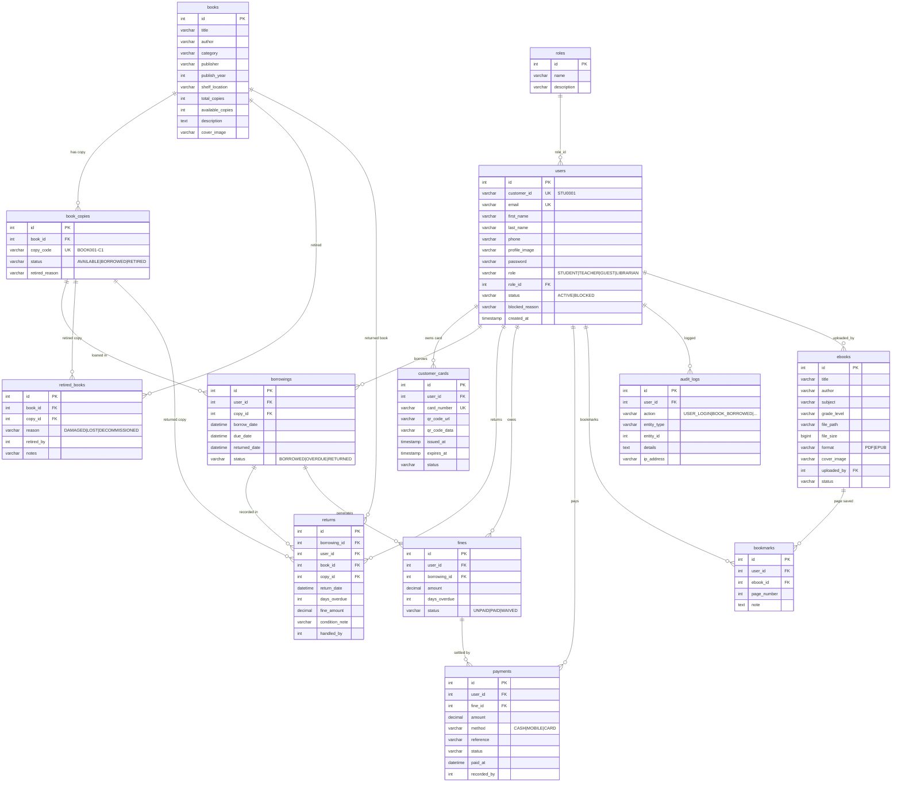

# Hope Haven School Library — ERD

Generated from the live MySQL schema (15 tables). Render the Mermaid block at mermaid.live, or paste into any Markdown viewer/GitHub.

## Mermaid ER Diagram

## Relationship map

| Table A | Relation | Table B | Via |
|---|---|---|---|
| roles | 1 — N | users | users.role_id |
| users | 1 — N | customer_cards | user_id |
| users | 1 — N | borrowings | user_id |
| books | 1 — N | book_copies | book_id |
| book_copies | 1 — N | borrowings | copy_id |
| borrowings | 1 — 1 | returns | borrowing_id |
| borrowings | 1 — N | fines | borrowing_id |
| fines | 1 — N | payments | fine_id |
| ebooks | 1 — N | bookmarks | ebook_id |
| users | 1 — N | bookmarks | user_id |
| books / book_copies | 1 — N | retired_books | book_id / copy_id |
| users | 1 — N | fines | user_id |
| users | 1 — N | payments | user_id |
| users | 1 — N | audit_logs | user_id |

## Logical modules

- **Users & Access** → `roles`, `users`, `customer_cards`
- **Books & Digital Catalog** → `books`, `book_copies`, `ebooks`, `bookmarks`
- **Circulation** → `borrowings`, `returns`, `retired_books`
- **Fine Management** → `fines`, `payments`
- **Audit & Logging** → `audit_logs`